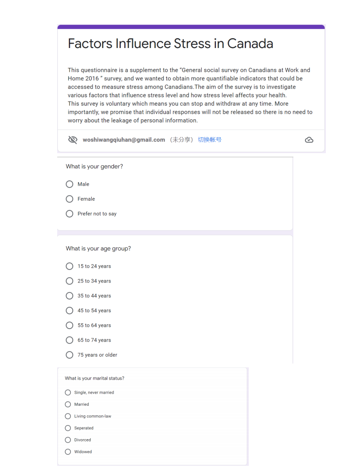
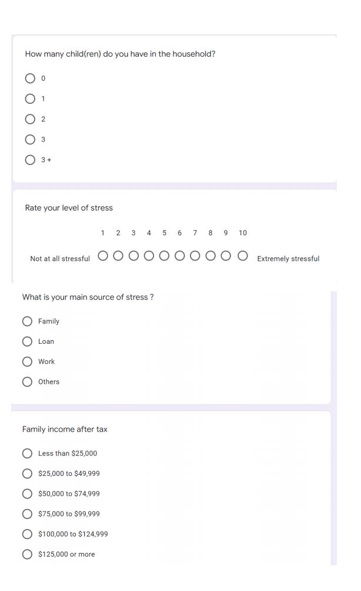
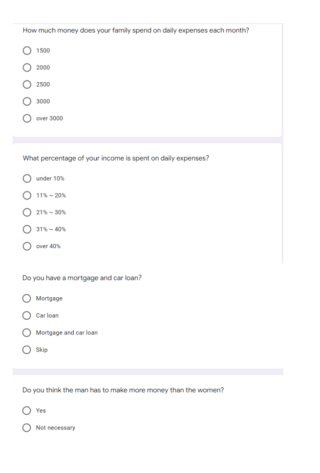
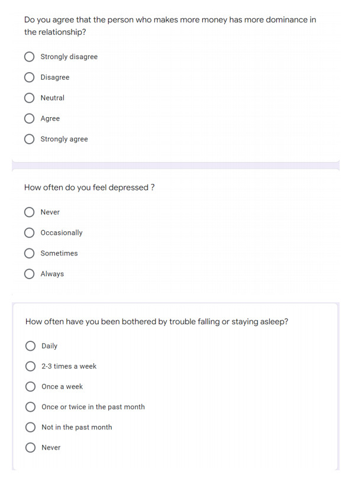
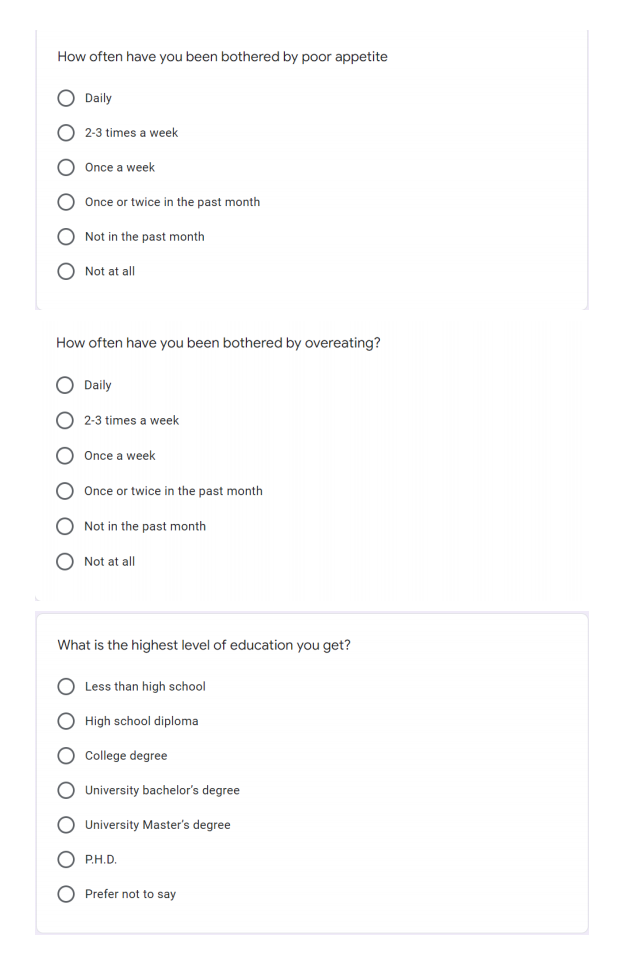
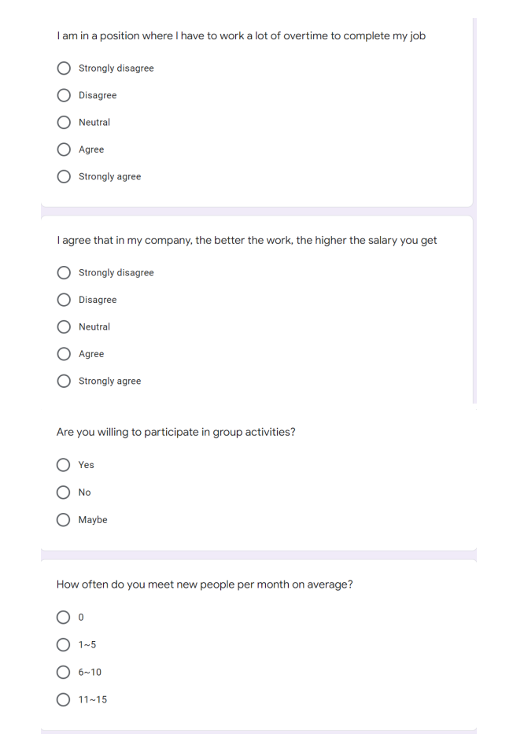
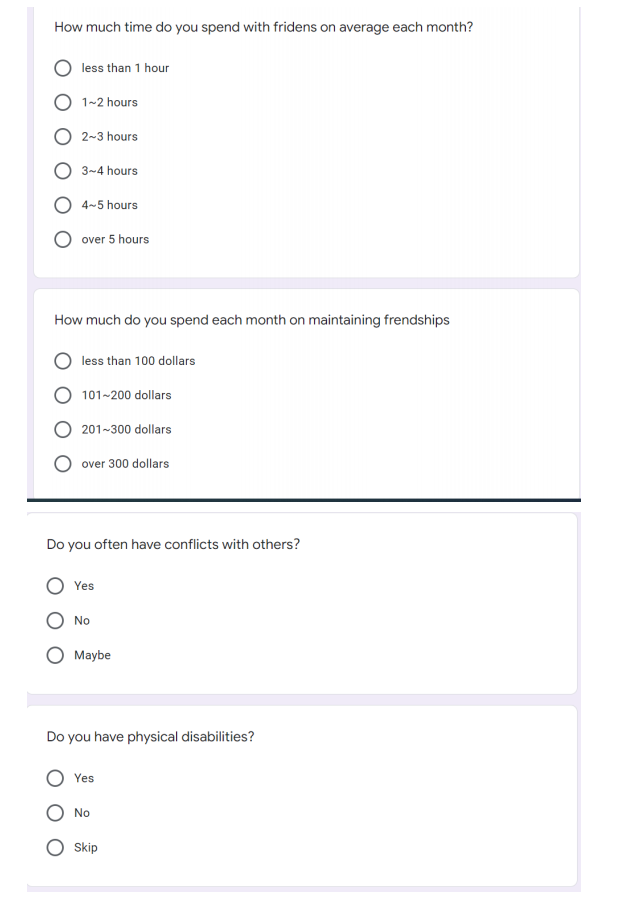
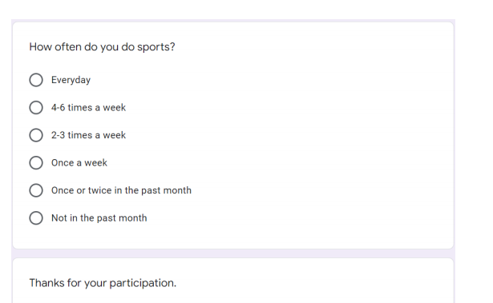

```{r setup, include=FALSE}
knitr::opts_chunk$set(echo = TRUE)
```


```{r,include=FALSE}
library(tidyverse)
library(ggplot2)
library(modelsummary)
```


```{r,include=FALSE}
# import data
clean_data<-  read_csv(here::here("inputs/data/clean data.csv"))
```


```{r ,include=FALSE}


clean_data <- clean_data %>%
  mutate(gender = case_when(sex == '1'~ "Male",
                            TRUE ~ "Female"))

maledata <- clean_data %>%
  filter(sex == '1')

femaledata <- clean_data %>%
  filter(sex =='2')
```


\newpage
# Introduction

More and more Canadian social and economic issues have led to many discussions about the relationship between work, lifestyle, and well-being. Although people are enjoying the conveniences from a technology high-quality life from economic growth, they face much pressure at the same time and even feel less happy than before. (Testing and modeling the fatigue behavior of GFPR composites, Wahid Ferdous, 2020) How to balance life and work in a competitive environment becomes a serious problem. Canadians are encouraged to assess and evaluate their stress level because the government can take actions to increase people’s well-being and decrease their pressure according to their responses. People’s healthy mental condition is beneficial to national growth. Our aim is to help the Canadian government further understand what the characteristics of stressed people are and how to reduce their stress.

Workload and working environment are two factors influencing people's stress levels, which were discussed in the book "Are Quebecers More Stressed Out at Work Than Other" by the University of Ottawa Department of Economics in 2016. We already know the standard of living and health conditions will affect people's stress level in the UK, maybe not in Canada so we want to see how the variables affect Canadians(Hulst et al., 2014). There are variables such as alcohol consumption and smoking frequency potentially affect stress level but weren't investigated before. 

A short survey was created and conducted in 2016 to assess the mental health of all persons who are equal to or larger than 15 years old in 10 provinces in Canada. To ensure proper stratification and geographic distribution, our sample population be reached via letter. The letters are sent to the households which include purpose and access code to login in survey applicants. In order to decrease the non-respond rate, the survey is conducted online and via telephone. From the response, most of the respondents feel not very stressful or a little bit stressful. To be more specific, the pressure mainly comes from work, while the pressure of females mainly comes from family. The number of children in households influences people’s stress levels as well. The logistic model displays that standard living and personal relationships are other two large factors to influence stress levels. 


The article is structured as follows. First, we introduce the survey including the survey method and detailed questionnaires relating to mental health. Second, some important variables such as sex, satisfaction with work, life habits are collected, in order to analyze what kind of group bears greater mental pressure. Finally, the supplementary survey is provided to get more information about the target group and increase the accuracy of the data.    


# Data


## Data collection

All the data used in this paper was retrieved from Candian General Social Survey (GSS). Candian GSS is a government-funded program that gathers data from social surveys to evaluate the well-being of Canadians. (Government of Canada, 2017) In this paper, we focus on the survey titled “General social survey on Canadians at Work and Home (cycle 30), 2016”. The survey was conducted from August to December 2016. Telephone interviews (landline and cellular) were conducted for a sample of the population aged over 15 years old living in 10 Canadian provinces. The survey is unique, there is no similar dataset in Canadian GSS. To protect the confidentiality of Canadians, the use of data from Canadian GSS is restricted. Data can be accessed by submitting a request form or through secure university settings. 

## Data processing 

All analysis was done with a statistic programming language R [@citeR]. We downloaded some important variables from the survey “General social survey on Canadians at Work and Home” like stress level, alcohol consumption, etc. from Canadian GSS and loaded it to R. During our analysis, we ignored the data for which the answer was skipped and not known using the R function “filter”. R package “tidyverse”[@citetidyverse] is used to manipulate the data and “ggplot2” [@citeggplot2] is used for data visualization. 


## Population and sample

The GSS survey collected 19,609 questionnaires. The target population is non-institutionalized individuals aged over 15 years old in 10 Canadian provinces. 
In this paper, we selected only some of the useful variables related to mental health in the survey and eliminated invalid responses. Therefore, our data is reduced and it contains 16440 observations. Since we have a large amount of data, removing some observations will not lead to a significant impact on the conclusions drawn from the data. We selected 16 variables such as gender, age, and job satisfaction that we thought would have an impact on the stress situation. In our analysis, we consider stress level as our response variable. 

Here we show an extract of our dataset.(Table \@ref(tab:tablestress))

```{r tablestress, echo=FALSE,message=FALSE,warning=FALSE}


clean_data <- clean_data %>%
  mutate(stress=fct_relevel(stress,"Extremely stressful", after=3)) %>%
   mutate(stress=fct_relevel(stress,"A bit stressful", after=1))


clean_data %>% 
  datasummary_skim(type = "categorical",
                   title = "Summary of categorical economic indicator 
                   variables for four countries")

```


## Survey method

We used the stratified sampling method to choose the households and convey the survey. The data provided by GSS was more authoritative and comprehend since it was collected by the Canadian government. The target population of the survey includes is all persons who are equal to or larger than 15 years old in Canada. The entire target population lives in 10 provinces of Canada including St. John’s, Halifax, Saint John, Montreal, Quebec City, Toronto, Ottawa, Hamilton, Winnipeg, Regina, Saskatoon, Calgary, Edmonton, and Vancouver. Also, People from Yukon, Northwest Territories, and Nunavut and full-time residents of institutions weren’t included in the survey. We stratified the population into 27 strata according to Census Metropolitan Areas in the 10 provinces, and each stratum was sampled without replacement. To ensure acceptable sampling variability at the stratum level and proper geographic distribution, we set minimum sample sizes in each province. The 2016 GSS sampling frame included the “cell phone only” households, which were not covered in previous frames. 86% of available telephone numbers linked to the address register (AR) and 14% of telephone numbers not linked to the AR were both included.  

The data were collected electronically as a self-completed questionnaire (EQ) via computer-assisted telephone interviews (CATI). To collect data, paper introductory letters were first sent to households and the letters provided the access code to log in to the online survey application. Once the application starts, the household member needed to fill in all family members’ information including sex, contact numbers, email address, and so on. The application randomly selected someone from the household as the respondent to complete EQ via emails and they were interviewed in the official language of their choice to solve language understanding problems. If the respondents provided valid emailing addresses or refused to participate in the survey, they were re-contacted via CATI to explain the importance of the survey, encouraged to participate, and interviewed. When the interviewing progressed by CATI, the responses to the question were entered into the computer and followed the flow of the questionnaire directly. Both EQ results and CATI data were transmitted to Statistics Canada.

A total of 19,609 respondents were sampled, among which 31.1% were responses obtained from EQ and 68.9% were responses obtained from CATI. Although efforts have been made to encourage responses, the overall response rate was only 50.8%. Non-response bias might cause the result to be underestimated or overestimated. Therefore, non-response was solved by adjustment. Total non-responding telephone numbers were dropped. Adjustments were made for partial non-response, so these households had some auxiliary information that was used to a model propensity to respond.

Non-sampling errors may occur at survey operation, especially in the CATI phase. In detail, using CATI, interviewers may misunderstand instructions and respondents may make errors in answering questions. Therefore, the results of the survey may be inaccurately recorded in the system so that the errors may be viewed in the final data. To combat this factor, many measures were used to promise the quality of data and reduce the non-sampling errors at the data collecting step. These measures included the use of highly skilled interviewer’s judging respondents’ answers accurately, training of interviewers focused on the questionnaire and observation of interviewers’ misunderstanding of instructions.


# Result


```{r piegraph,warning=FALSE,message=FALSE,echo = FALSE}
names = c("Work", 
          "Financial concerns", 
          "Family", 
          "School work", 
          "Not enough time", 
          "Own health", 
          "Other" )


# count the number of people for each main source of stress
p1 <- sum(clean_data$source_of_stress ==1) 
p2 <- sum(clean_data$source_of_stress ==2)
p3 <- sum(clean_data$source_of_stress ==3)
p4 <- sum(clean_data$source_of_stress ==4)
p5 <- sum(clean_data$source_of_stress ==5)
p6 <- sum(clean_data$source_of_stress ==6)
p7 <- sum(clean_data$source_of_stress ==7)

y=c(p1,p2,p3,p4,p5,p6,p7)

# calculate the percentage
piepercent = paste(round(100*y/sum(y)), "%")
pie(y, labels=piepercent,col = rainbow(length(y)), main ="Main source of stress")
legend("topright", names, cex=0.8, fill=rainbow(length(y)))


par(mfrow=c(1,2))

m1 <- sum(maledata$source_of_stress ==1) 
m2 <- sum(maledata$source_of_stress ==2)
m3 <- sum(maledata$source_of_stress ==3)
m4 <- sum(maledata$source_of_stress ==4)
m5 <- sum(maledata$source_of_stress ==5)
m6 <- sum(maledata$source_of_stress ==6)
m7 <- sum(maledata$source_of_stress ==7)

y1=c(m1,m2,m3,m4,m5,m6,m7)

# calculate the percentage
piepercent = paste(round(100*y1/sum(y1)), "%")
piemale <-pie(y1, 
              labels=piepercent,
              col = rainbow(length(y1)), 
              main ="Main source of stress for male")


fm1 <- sum(femaledata$source_of_stress ==1) 
fm2 <- sum(femaledata$source_of_stress ==2)
fm3 <- sum(femaledata$source_of_stress ==3)
fm4 <- sum(femaledata$source_of_stress ==4)
fm5 <- sum(femaledata$source_of_stress ==5)
fm6 <- sum(femaledata$source_of_stress ==6)
fm7 <- sum(femaledata$source_of_stress ==7)

y2=c(fm1,fm2,fm3,fm4,fm5,fm6,fm7)

# calculate the percentage
piepercent = paste(round(100*y2/sum(y2)), "%")
piefemale <-pie(y2, 
              labels=piepercent,
              col = rainbow(length(y2)), 
              main ="Main source of stress for female")
```


```{r hours,warning=FALSE,message=FALSE,echo = FALSE}
Name = c("0-15 hours", 
         "16-29 hours", 
          "30 to 40 hours", 
          "Over 41 hours")
h1 <- sum(clean_data$hours_worked =='1') 
h2 <- sum(clean_data$hours_worked =='2')
h3 <- sum(clean_data$hours_worked =='3')
h4 <- sum(clean_data$hours_worked =='4')

hour=c(h1,h2,h3,h4)
cols = c("#ED1C24","#22B14C","#FFC90E","#3f48CC")
# calculate the percentage
piepercent = paste(round(100*hour/sum(hour)), "%")
# draw the pie graph
pie(hour, labels=piepercent,col = cols, main ="Number of hours worked per week at job")
legend("topright", Name, cex=0.8, fill=cols)
```


```{r alcohol,warning=FALSE,message=FALSE,echo = FALSE}
# create a function to arrange elements alphabetically


ggplot(clean_data,
       aes(x=stress,
           fill = factor(alcohol_consumption, 
                         levels =c("1","2","3","4","5","6","7"),
                         labels = c("Everyday",
                                    "4-6 times a week",
                                    "2-3 times a week",
                                    "Once a week",
                                    "Once or twice in the past month",
                                    "Not in the past month","Never")))
       ) +
geom_bar(position = "stack") +
labs(x="stress level",
     fill="Alcohol consumption",
     title="Alcohol consumption and stress level") +
coord_flip() +
theme_minimal()

```


```{r smoking,warning=FALSE,message=FALSE,echo = FALSE}
ggplot(clean_data,
       aes(x=stress,
           fill= factor(smoking_status,
                        levels =c("1","2","3"),
                        labels = c("Daily",
                                    "Occasionally",
                                    "Not at all")))
       )+
geom_bar(position = "stack") +
labs(x="stress level",
     fill="Smoking status",
     title="Smoking status and stress level") +
coord_flip() +
theme_minimal()
```


```{r satisfaction,warning=FALSE,message=FALSE,echo = FALSE}
ggplot(clean_data, 
       aes(x = stress, 
           fill = factor(job_satisfaction))) + 
geom_bar(position = "dodge") +
labs(x="stress level",
     fill="Job satisfaction",
     title="Job satisfaction and stress level")


ggplot(clean_data, 
       aes(x = stress, 
           fill = factor(personal_relationship_level))) + 
geom_bar(position = "dodge") +
labs(x="stress level",
     fill="Personal relationships",
     title="Personal relationships and stress level")
```
 


```{r regression, warning=FALSE,message=FALSE,echo = FALSE}


regression_model <- lm(stresslevel ~ sex+ health_level +personal_relationship_level +number_of_children +age_group+ job_satisfaction +appearance_level, data=clean_data)

modelsummary(regression_model)
```


We can see that almost half of the sampling population works 40 hours per week, and nearly a quarter of people has to work overtime to complete their job from figure \@ref(fig:hours). Constantly working long hours might lead to fatigue,  lower performance level of employees and lack of free time etc.-all of which makes employees feel overwhelmed and high level of stress. From table  \@ref(tab:tablestress) and figure \@ref(fig:piegraph), we can tell that Canadian people generally have lower stress levels and work and family are the main sources of stress in life. 80% of Canadians feel a little stress in life. Work stress accounts for the largest share of stress, which is 23%. If we look into the details of the graphs, we find that there is a big difference in the sources of stress for men and women. 26% of women cite family as their primary source of stress, twice as many as men. 32% of males consider work as their main source of stress, while that of female is 18%. We can tell from the graphs that women take more responsibility for child care, housework, while men are the main breadwinners. 

From figure \@ref(fig:alcohol) about 10% of people who feel not very stressful and a bit stressful smoke every day, and 20% of people who feel extremely stressful smoke every day. When stress becomes excessive, many Canadians increase the use of cigarettes to relieve stress in life. However, in figure \@ref(fig:smoking) there is no strong correlation between stress level and alcohol consumption. Many people smoke to ease feelings of stress, however, smoking only makes things worse. Smoking increases the risks of cancer, lung disease, and many chronic diseases. Nicotine provides immediate relaxation, but the effect is temporary. The feeling of relaxation is actually the symptom of withdrawal from nicotine (Choi et al., 2015). 

From figure \@ref(fig:satisfaction), we can conclude that job satisfaction and personal relationship are negatively correlated with stress. people are satisfied with their job and confident about their personal relationships usually not bothered by stress. 

Based on our findings above, we build a linear regression model to estimate Canadian's stress level. From table \@ref(tab:regression), older people with lower job satisfaction and lower health level has higher stress level. Appearance level and personal relationship level has weak correlation with stress. However, our model has a low R-Squared value, which suggests that the goodness of fitting is not ideal. 


# Discussion

## Purpose and summary for the survey

Nowadays, more and more people suffer pressure from work, financial concerns, family, school work, health conditions, time management, and other aspects. To improve people’s satisfaction with life and reduce people’s pressure, investigating their pressure resources is necessary. 

In the report, we use the “Canadians at Work and Home” aspect of 2016 Canadian Government General Social Survey data to analyze the target population’s stress level. Our target population includes all persons who are equal to or larger than 15 years old in St. John’s, Halifax, Saint John, Montreal, Quebec City, Toronto, Ottawa, Hamilton, Winnipeg, Regina, Saskatoon, Calgary, Edmonton, and Vancouver(10 provinces of Canada). Canadian government statistics collected responders’ results via email and telephone.

To analyze the factors influencing the target population’s stress level, we select 14 variables from GSS including sex, age group, children in household, number of hours worked per week at the job, level of stress in life, the stress in life, alcohol consumption, smoking at present, job satisfaction, discrimination, the standard of living, health satisfaction, personal relationships, personal appearance satisfaction. In the research, we identify the characteristics of the high-pressure group and find the main pressure resources for males and females, so some measures can be made according to the results. To get more information and help responders learn their stress level and satisfactions of their lives, we add a questionnaires survey in the Appendix to increase the accuracy of the survey.


## Learn about the world

From the result of the survey, we learn that the overall stress level in 10 provinces of Canada has room to be decreased. Because 43.2% people feel a bit stressed and 13.9% people feel quite a bit stressed. 

After further researching, on the one hand, we find that females are more likely to take on family responsibilities. They are expected to do housework, look after children and the old. The pressure level of females in the family having 4 children is higher than those in the family having 1 child because mothers usually take responsibility for meticulous care for children. If males in the family would like to share some housework, females’ workload can be reduced. If the government announces more policies to take care of the old, it’s beneficial to improve family living qualities as well. On the other hand, we find that males’ pressure mainly comes from work. 24% of people work more than 41 hours per week, which means that they work over 8 hours per weekday or they work on the weekend. Long hours at work may bring pressure and anxiety to people. High workload and overtime working can be considered reasons why people feel stressed from work. According to this finding, we suggest the managers of companies balance workers’ leisure time and work time, and allocate tasks to each worker wisely. Also, career discrimination should be avoided in working, because the bad relationship between colleagues not only influences the workers’ mental health but also influences work efficiency. Creating a good working environment should be encouraged.

To the people who feel stressful because of their health condition, the companies where they work can provide physical examinations to them. A physical examination can help people assess their health status, so some potential illnesses can be discovered as early as possible. The government can give more subsidies to people with serious diseases in order to help them recover. 
       

## Weakness and areas in the future

Our survey method contains some limitations and the survey method can be improved by some approaches. First, in the survey, we only select one of the members in a household which means that the member who is selected cannot represent other household members’ opinions. It may influence the accuracy of the result. Therefore, selecting more members in a household may be a better way to collect data. Second, the government statistic department connects with respondents via mail or telephone. This process may ignore the group of people who cannot connect with these two approaches, such as the homeless. However, the responses from this group are valuable to our research, because this particular group of people is more likely to suffer from stress. The homeless’ job satisfaction, unfair treatment/discrimination, participation in outdoor activities, and other variables may be different from existing respondents’. The homeless’ living habits including alcohol consumption and smoking frequency may need to be further investigated. In the future survey, we suggest adding a new approach in-person questionnaire to collect data so that the homeless group can be contained. 

Some non-sampling errors occur in the survey as well. Using CATI to collect data, interviewers may misunderstand instructions, and respondents, especially the olds may make errors in answering questions. Therefore, the results of the survey may be inaccurately recorded in the system so that the errors may be viewed in the final data. To combat this factor and promise the quality of data, some technical measures should be considered. These measures included the use of highly skilled interviewers judging respondents’ answers accurately, training of interviewers focused on the questionnaire, and observation of interviewers’ misunderstanding of instructions.

In addition, some questions in the survey are ambiguous which may influence the result of the survey. To be more specific, everyone has his standards to estimate his job satisfaction from 1 to 10 so that we cannot unitize the results. Also, some responders cannot identify their stress level because it’s so abstract. Therefore, we do an additional questionnaire to help responders rate themselves. For example, we add questions “How often have you been bothered by poor appetite?” and “How often do you feel depressed?” to describe details of stress. Similar ambiguous self-rating questions appearing in job satisfaction and other variables, we suggest using more specific questions instead as well.

Our model has a low R-Squared value when we use the regression model to analyze the relationship among sex, stress level, health level, personal relationship level, number of children, and appearance level. Low R-squared value displays that the goodness of fitting is not ideal. Therefore, we need to select the more related variable in further investigation.

Finally, we should do more research to describe the impacts of stress. When people are fully aware of the harm of high-stress levels to their health condition and mental condition, they would pay attention to deal with pressure. The social problem, like “How to balance life, work and well-being”, can raise concern. 


\newpage
# Supplementary survey 


## Survey introduction

Dear participants,

I am writing to invite you to participate in this research by completing the following questionnaire. This survey aims to study various factors that make Canadians feel stressed. The following questionnaire contains a few multiple-choice questions and it will take approximately 5 minutes. All data collected will be kept confidential by the government of Canada. An extensive disclosure risk analysis is conducted before releasing the data to ensure that the data does not reveal personal information. Individual responses are not shared.

Thanks for your corporation.

Sincerely,

On behalf of the government of Canada

## Queationnaire

https://docs.google.com/forms/d/e/1FAIpQLSdCXMqiHZyVJzhO5mn4ewHXJ_EHNakJrglcv-p3J-DQEncBTw/viewform?usp=sf_link

\newpage

```{r,echo=FALSE, fig.align='center', out.width = '80%'}

```


\newpage


```{r,echo=FALSE, fig.align='center', out.width = '80%'}

```


\newpage

```{r,echo=FALSE, fig.align='center', out.width = '80%'}

```


\newpage

```{r,echo=FALSE, fig.align='center', out.width = '80%'}

```


\newpage

```{r,echo=FALSE, fig.align='center', out.width = '80%'}

```


\newpage

```{r,echo=FALSE, fig.align='center', out.width = '80%'}

```


\newpage

```{r,echo=FALSE, fig.align='center', out.width = '80%'}

```


\newpage


```{r,echo=FALSE, fig.align='center', out.width = '80%'}

```


\newpage
# Reference

H. Wickham. ggplot2: Elegant Graphics for Data Analysis. Springer-Verlag New 
York, 2016.

Government of Canada, S. C. (2017, February 27). The General Social Survey: An 
overview. Government of Canada, Statistics Canada. Retrieved March 8, 2022, from https://www150.statcan.gc.ca/n1/pub/89f0115x/89f0115x2013001-eng.htm

R Core Team (2021). R: A language and environment for statistical computing. R 
Foundation for Statistical Computing, Vienna, Austria. URL
https://www.R-project.org/.
  
Vincent Arel-Bundock (2022). modelsummary: Summary Tables and Plots for 
Statistical Models and Data: Beautiful, Customizable, and Publication-Ready. R
package version 0.9.6. https://CRAN.R-project.org/package=modelsummary
  
Wickham et al., (2019). Welcome to the tidyverse. Journal of Open Source 
Software, 4(43), 1686, https://doi.org/10.21105/joss.01686
  
```{r, include=FALSE}
citation()

citation(package = "ggplot2")
citation(package = "modelsummary")
```

